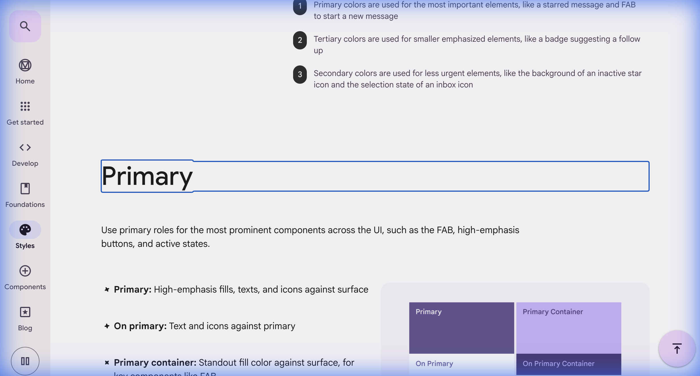
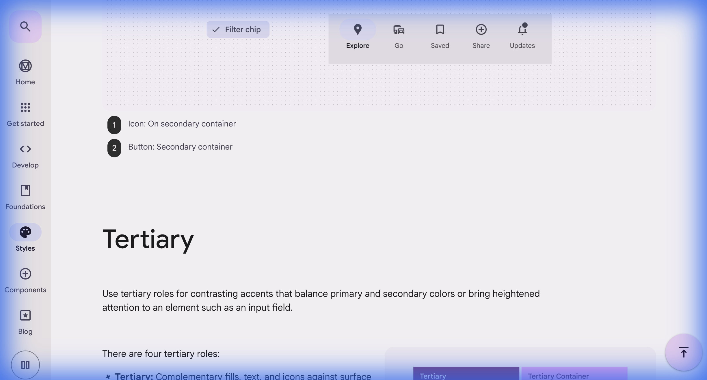

# Material Design 3 (M3) UI 컬러 시스템 정리

Material Design 3의 컬러 시스템은 **다이내믹 컬러(Dynamic Color)**와 **톤 팔레트(Tonal Palettes)**를 핵심으로 하며, 접근성과 일관성을 유지하면서도 사용자 맞춤형 테마를 지원하도록 설계되었습니다.

---

## 1. 핵심 구조

### 소스 컬러 (Source Color)
- 사용자의 배경화면이나 브랜드의 대표 색상 **하나**를 기반으로 시스템 전체의 테마를 생성
- 이 하나의 색상에서 알고리즘을 통해 전체 컬러 팔레트가 자동 생성됨

### 5가지 키 컬러 (Key Colors)
소스 컬러에서 추출된 5가지 핵심 팔레트:

1. **Primary (주요 색상)**
   - 가장 강조되는 UI 요소 (FAB, 중요 버튼, 활성 상태 등)
   
2. **Secondary (보조 색상)**
   - 덜 강조되는 보조적인 요소 (비활성 탭, 선택 상태 등)
   
3. **Tertiary (제3의 색상)**
   - 대비를 주거나 균형을 맞추는 악센트 요소 (입력 필드, 배지 등)
   
4. **Neutral (중립)**
   - 배경 및 표면(Surface) 색상
   
5. **Neutral Variant (중립 변형)**
   - 테두리(Outline) 및 표면 변형 색상

### 톤 팔레트 (Tonal Palettes)
각 키 컬러는 명도에 따라 **0(검정)부터 100(흰색)까지 13개의 톤(Tone)**으로 나뉩니다:

```
톤 값: 0, 10, 20, 30, 40, 50, 60, 70, 80, 90, 95, 98, 99, 100
```

- 각 톤은 일관된 명도 대비를 보장하여 접근성을 자동으로 유지
- 라이트/다크 테마 전환 시 동일한 팔레트 내에서 다른 톤을 선택

---

## 2. 컬러 역할 (Color Roles) - 총 26개

M3는 컴포넌트에 색상을 **직접 지정하지 않고** '역할(Role)'을 통해 지정합니다.

### Accent Roles (강조 색상)
Primary, Secondary, Tertiary 그룹으로 나뉘며 각각 4가지 역할을 가집니다:

#### Primary 그룹
- **Primary**: 요소의 채우기 색상 (고강조 버튼, 활성 상태)
- **On Primary**: Primary 색상 위의 텍스트/아이콘 색상
- **Primary Container**: 강조도가 낮은 컨테이너 색상
- **On Primary Container**: Primary Container 위의 텍스트/아이콘 색상

#### Secondary 그룹
- **Secondary**: 덜 중요한 요소의 채우기 색상
- **On Secondary**: Secondary 색상 위의 텍스트/아이콘 색상
- **Secondary Container**: 강조도가 낮은 보조 컨테이너
- **On Secondary Container**: Secondary Container 위의 텍스트/아이콘 색상

#### Tertiary 그룹
- **Tertiary**: 악센트 요소의 채우기 색상
- **On Tertiary**: Tertiary 색상 위의 텍스트/아이콘 색상
- **Tertiary Container**: 강조도가 낮은 악센트 컨테이너
- **On Tertiary Container**: Tertiary Container 위의 텍스트/아이콘 색상

### Surface Roles (표면 색상)
그림자 대신 **색상의 대비로 계층**을 표현합니다:

- **Surface**: 기본 배경 색상
- **On Surface**: Surface 위의 텍스트/아이콘 색상
- **Surface Variant**: 표면의 변형 색상
- **On Surface Variant**: Surface Variant 위의 텍스트/아이콘 색상
- **Surface Bright**: 밝은 표면 (다크 테마에서 사용)
- **Surface Dim**: 어두운 표면 (라이트 테마에서 사용)

#### Surface Container (고도 시스템)
고도(Elevation)에 따른 5단계 컨테이너 색상:

1. **Surface Container Lowest**: 가장 낮은 고도
2. **Surface Container Low**: 낮은 고도
3. **Surface Container**: 기본 고도
4. **Surface Container High**: 높은 고도
5. **Surface Container Highest**: 가장 높은 고도

### Outline Roles (경계선)
- **Outline**: 요소의 경계나 구분선
- **Outline Variant**: 덜 강조되는 경계선

### Error Roles (오류 상태)
- **Error**: 오류 상태를 나타내는 색상
- **On Error**: Error 색상 위의 텍스트/아이콘 색상
- **Error Container**: 오류 컨테이너 색상
- **On Error Container**: Error Container 위의 텍스트/아이콘 색상

### 기타 Roles
- **Background**: 앱의 배경 색상
- **On Background**: Background 위의 텍스트/아이콘 색상
- **Inverse Surface**: 반전된 표면 색상 (스낵바 등)
- **Inverse On Surface**: Inverse Surface 위의 텍스트/아이콘 색상
- **Inverse Primary**: 반전된 Primary 색상

---

## 3. 라이트 및 다크 테마 적용

동일한 톤 팔레트 내에서 테마에 따라 **다른 톤을 선택**하여 접근성을 보존합니다.

### 라이트 테마 예시
```
Primary: 톤 40
On Primary: 톤 100
Primary Container: 톤 90
On Primary Container: 톤 10
Surface: 톤 98
On Surface: 톤 10
```

### 다크 테마 예시
```
Primary: 톤 80
On Primary: 톤 20
Primary Container: 톤 30
On Primary Container: 톤 90
Surface: 톤 6
On Surface: 톤 90
```

---

## 4. HCT 컬러 스페이스

M3는 **HCT (Hue, Chroma, Tone)** 컬러 스페이스를 사용합니다:

- **Hue (색상)**: 0-360도의 색상 각도
- **Chroma (채도)**: 색상의 선명도/강도
- **Tone (명도)**: 0-100의 밝기 값

HCT는 인간의 시각적 인지에 최적화되어 있으며, 모든 톤 값에서 일관된 명도 대비를 보장합니다.

---

## 5. 주요 특징 및 장점

### ✅ 접근성 자동 보장
- 모든 컬러 조합이 WCAG 명도 대비 기준을 자동으로 충족
- `On [Color]` 역할이 항상 충분한 대비를 제공

### ✅ 그림자 없는 계층 구조
- Surface Container 시스템을 통해 색상만으로 UI 계층 표현
- 성능 최적화 및 일관된 디자인 언어 제공

### ✅ 다이내믹 컬러
- 사용자의 배경화면에서 자동으로 테마 생성 (Android 12+)
- 브랜드 아이덴티티 유지하면서도 개인화 가능

### ✅ 테마 전환 용이성
- 동일한 역할 체계로 라이트/다크 테마 간 매끄러운 전환
- 디자이너와 개발자 간 명확한 커뮤니케이션

---

## 6. 실제 적용 예시

### 버튼 컴포넌트
```
Filled Button (고강조):
- Background: Primary
- Text: On Primary

Outlined Button (중강조):
- Border: Outline
- Text: Primary

Text Button (저강조):
- Text: Primary
```

### 카드 컴포넌트
```
Elevated Card:
- Background: Surface Container Low
- Text: On Surface

Filled Card:
- Background: Surface Container Highest
- Text: On Surface
```

---

## 7. 스크린샷 참고

아래 스크린샷에서 M3 컬러 시스템의 실제 적용 예시를 확인할 수 있습니다:





---

## 8. 핵심 요약

Material Design 3의 컬러 시스템은:

1. **하나의 소스 컬러**에서 5가지 키 컬러 팔레트 생성
2. 각 팔레트는 **13개의 톤** (0-100)으로 구성
3. **26개의 컬러 역할**을 통해 의미론적으로 색상 적용
4. **HCT 컬러 스페이스**로 접근성 자동 보장
5. **Surface Container 시스템**으로 그림자 없이 계층 표현
6. 라이트/다크 테마 간 **매끄러운 전환** 지원

이는 단순한 색상 선택을 넘어, **알고리즘 기반의 체계적인 디자인 시스템**입니다.
